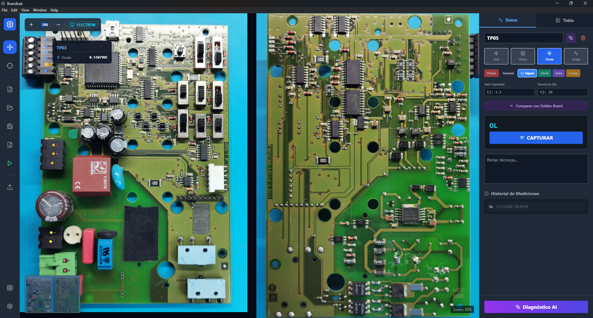
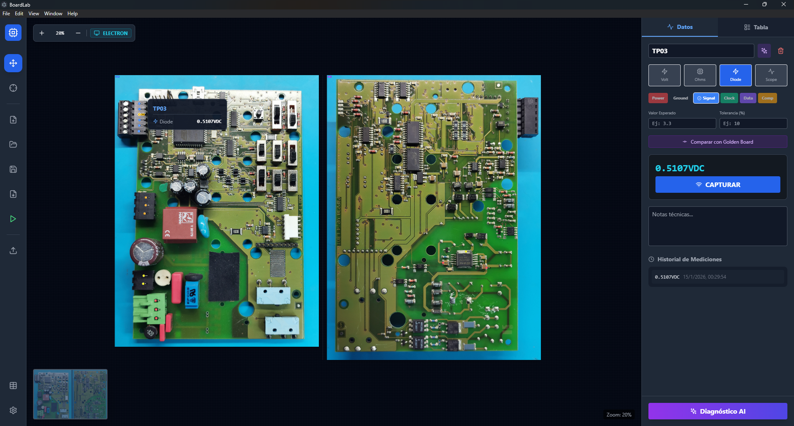
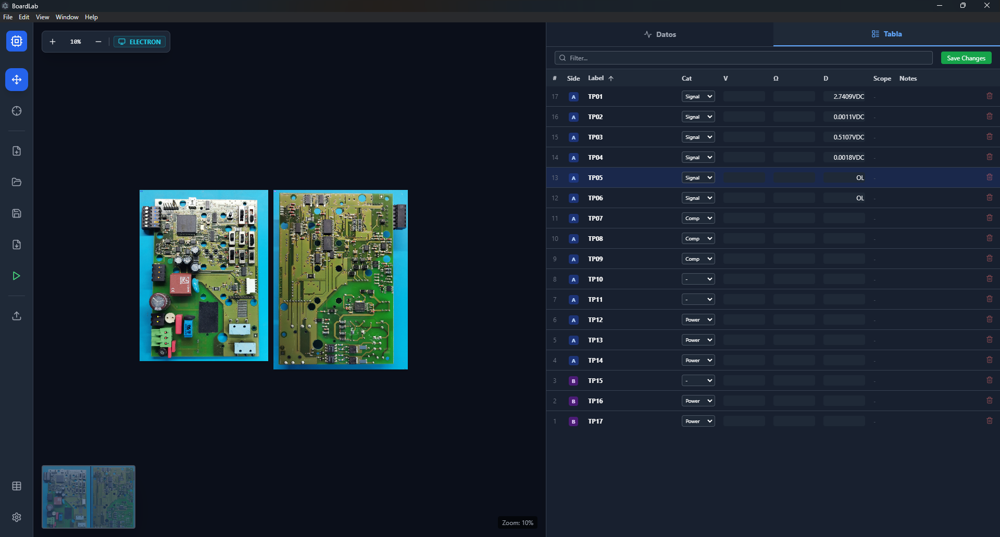

# BoardLab - Intelligent Electronics Diagnosis Platform

BoardLab is a desktop application designed for electronics repair technicians and engineers. It streamlines the process of reverse engineering and diagnosing circuit boards (PCBs) by combining high-resolution image mapping with real-time hardware measurements and AI assistance.





## 🚀 Key Features

### 🛠️ Interactive Board View
- **Dual-Side Support**: Upload and view both Side A and Side B of a PCB simultaneously side-by-side.
- **Smart Mapping**: Click anywhere on the board image to create measurement points.
- **Minimap & Zoom**: High-performance pan and zoom capabilities for high-resolution inspection.

### 🔌 Hardware Integration
- **Owon XDM Series Multimeters**: Read Voltage, Resistance, and Diode drop values directly into the software via TCP/IP.
- **Rigol DHO Series Oscilloscopes**: Capture live waveforms, Vpp, and Frequency directly attached to a specific test point.
- **Generic SCPI Support**: Connect any SCPI-compatible instrument via TCP/IP or USB Serial (COM Ports).
- **Real-time Monitoring**: "Monitor Mode" continuously watches measurement values for hands-free triggering.

### 🧠 AI Assistant (Gemini)
- **Context-Aware Diagnosis**: Ask questions about specific components or measurements.
- **Board Analysis**: The AI analyzes your measurements against expected values to suggest potential faults.
- **Chat Interface**: Integrated chat panel to brainstorm repair strategies.

### 📊 Project & Data Management
- **Database Backend**: All projects, points, and measurement history are stored locally in a SQLite database.
- **Sequencer Mode**: Define a sequence of test points and rapidly measure them one by one.
- **Golden Board Comparison**: Compare measurements from a faulty board against a known-good "Golden Board" project.
- **Reports**: Generate detailed PDF reports with waveforms and measurement logs.

## 🛠️ Tech Stack

- **Framework**: [Electron](https://www.electronjs.org/) (Desktop Runtime)
- **Frontend**: [React 18](https://react.dev/), [TypeScript](https://www.typescriptlang.org/), [Vite](https://vitejs.dev/)
- **Styling**: [Tailwind CSS](https://tailwindcss.com/)
- **Database**: [better-sqlite3](https://github.com/WiseLibs/better-sqlite3) (Running in a separate Worker thread for performance)
- **Hardware Comms**: Node.js `net` (TCP) and `serialport` (Serial) for SCPI communication

## 📁 Project Structure

```
src/
├── components/           # React UI Components
│   ├── board/            # Board-specific components (PointMarker, PointTooltip, etc.)
│   ├── modals/           # Modal dialogs (NewProject, Comparison, ProjectManager, AI)
│   ├── BoardView.tsx     # Main interactive board canvas
│   ├── AIPanel.tsx       # Measurement panel and point details
│   ├── Settings.tsx      # Application settings
│   ├── InstrumentManager.tsx  # Instrument configuration UI
│   ├── SequencerPanel.tsx     # Sequential measurement mode
│   └── ...               # Other UI components (Toolbar, Minimap, Waveform, etc.)
├── contexts/             # React Context providers
│   ├── ProjectContext.tsx    # Global project state management
│   └── NotifierContext.tsx   # Toast notifications
├── hooks/                # Custom React hooks
│   ├── useBoard.ts       # Board interaction logic (pan, zoom, undo/redo)
│   ├── useHardware.ts    # Instrument communication
│   └── useGemini.ts      # AI integration
├── utils/                # Utility modules
│   ├── logger.ts         # Centralized logging framework
│   ├── safeElectronAPI.ts    # Validated IPC wrapper
│   ├── ipcValidation.ts  # Zod schemas for IPC responses
│   └── safeJson.ts       # Safe JSON parsing utilities
├── types.ts              # TypeScript type definitions
└── BoardLab.tsx          # Main application layout

electron/
├── main.ts               # Main process (window management, IPC handlers)
├── preload.ts            # Preload script (secure bridge to renderer)
├── db-worker.ts          # SQLite database operations (Worker thread)
└── drivers/              # Instrument drivers
    ├── GenericSCPIDriver.ts  # Generic SCPI protocol handler
    ├── rigol.ts          # Rigol oscilloscope driver
    └── connection.ts     # TCP/Serial connection management
```

## �📦 Installation

### Prerequisites
- [Node.js](https://nodejs.org/) (v18 or higher)
- [Git](https://git-scm.com/)

### Setup

1. **Clone the repository**
   ```bash
   git clone https://github.com/Fzf-z/boardlab.git
   cd boardlab
   ```

2. **Install dependencies**
   ```bash
   npm install
   # This will also compile native modules (better-sqlite3) automatically
   ```

3. **Run in Development Mode**
   ```bash
   npm start
   ```
   This launches the Vite dev server and the Electron app window.

### Build for Production

To create a distributable executable (exe/dmg/appImage):

```bash
npm run build
```
The output will be in the `dist` folder.

## 📖 Usage Guide

1.  **Create a Project**:
    *   Click "Open/Create Project" -> "New Project".
    *   Enter Board Model (e.g., "MacBook 820-00165").
    *   Upload images for **Side A** and optionally **Side B**.
    *   Click "Create".

2.  **Add Test Points**:
    *   **Click** anywhere on the board image to place a point.
    *   If you uploaded two sides, points clicked on the right image are automatically assigned to **Side B**.
    *   **Right-click + Drag** to pan around. **Scroll** to zoom.

3.  **Measure**:
    *   Select a point.
    *   Choose the measurement type (Voltage, Resistance, Diode, Oscilloscope) in the right panel.
    *   Ensure your instrument is connected (Settings -> Configure IP).
    *   Click **"CAPTURAR"** (Capture) or press **Enter**.

4.  **Compare**:
    *   Go to "Comparar con Golden Board".
    *   Select a reference project to overlay expected values or find matching points.

## ⚙️ Hardware Configuration

Go to **Settings** (Gear Icon) to configure your instruments:

*   **Multimeter (Owon)**: Set the IP address and Port (default 9876 via ESP32 Bridge).
*   **Oscilloscope (Rigol)**: Set the IP address and Port (default 5555).

*Note: The software uses SCPI commands over TCP. It may be compatible with other instruments that support the same command set with minor tweaks to `electron/drivers/`.*

## ⌨️ Keyboard Shortcuts

| Key | Action |
| :--- | :--- |
| **Space** | Switch to **View Mode** (Pan) |
| **M** | Switch to **Measure Mode** |
| **Enter** | **Capture Measurement** (on selected point) |
| **Del** | Delete selected point |
| **Esc** | Deselect point / Close Modal |
| **Arrow Up/Down** | Navigate through points list |
| **Ctrl + S** | Save Project |
| **Ctrl + Z** | Undo last action |
| **Ctrl + Y** | Redo action |
| **V** | Set Point Type: **Voltage** |
| **R** | Set Point Type: **Resistance** |
| **D** | Set Point Type: **Diode** |
| **G** | Set Point Type: **Ground** |
| **O** | Set Point Type: **Oscilloscope** |

## ❓ Troubleshooting

*   **Connection Failed (Instruments)**:
    *   Ensure the PC and instruments are on the same local network (LAN).
    *   Verify the IP Address and Port in **Settings**.
    *   Check firewall settings (Port 9876 for Owon, 5555 for Rigol).
*   **Database Error**:
    *   The app stores data in `%APPDATA%/BoardLab/boardlab.db`. Ensure you have write permissions.
*   **AI Not Responding**:
    *   Verify you have entered a valid Gemini API Key in **Settings**.
    *   Check your internet connection.

## 🤝 Contributing

Contributions are welcome! Please open an issue or submit a pull request for any bugs or feature requests.

## 🤖 Development & Credits

This project was developed with the assistance of **Google Gemini 3 Pro Preview** and **Claude Opus 4.5**, leveraging advanced AI for code generation, architecture planning, and debugging.

## 📄 License

[MIT](LICENSE)
